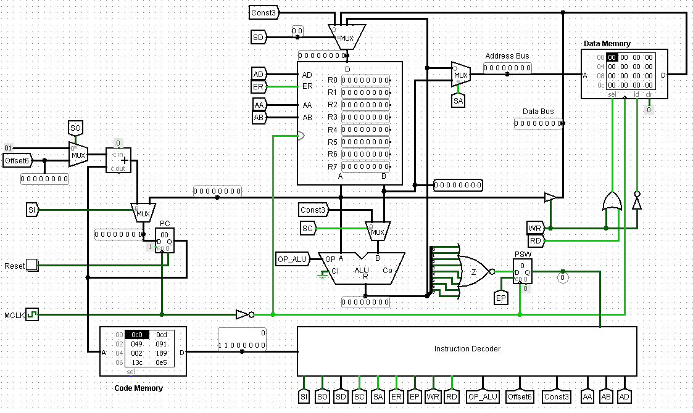
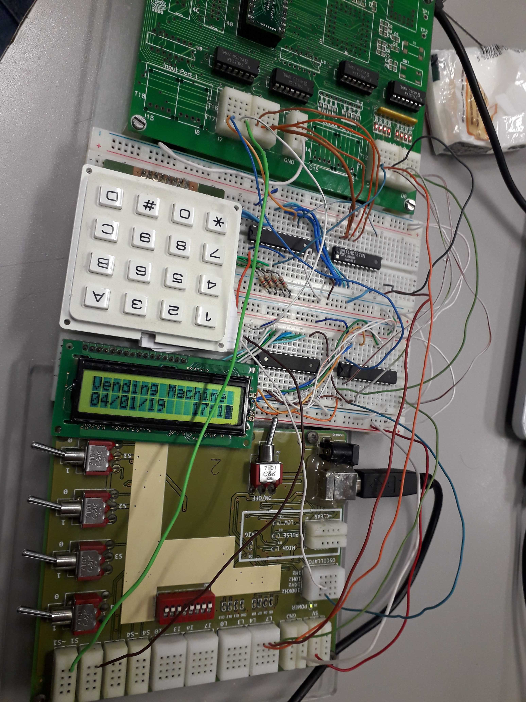

In this repo, I group 3 subjects from college
- LSD -> Lógica e Sistemas Digitais -> Logic and Digital Systems
- AC -> Arquitetura de Computadores -> Computer Architecture
- LIC -> Laboratório de Informática e Computadores -> Informatics and Computer Laboratory

At the time I wasn't very organized, so some things are incomplete or not very pretty. These assignments and content include: 
- boolean algebra
- logic gates
- ALU (Arithmetic Logic Unit) circuit
- a simple 8 bit CPU (Central Processing Unit) circuit and other things.

## Highlights
### [AC - T1 - Instruction Set Architecture and opcodes of a 8 bit](./Subject_AC/trab1/)
</img>

### [LIC - Vending Machine](./Subject_LIC/)
</img>

## Programs to design logic gate circuits
1. http://www.cburch.com/logisim/, https://github.com/lawrancej/logisim, https://sourceforge.net/projects/circuit/files/latest/download
2. https://github.com/logisim-evolution/logisim-evolution
